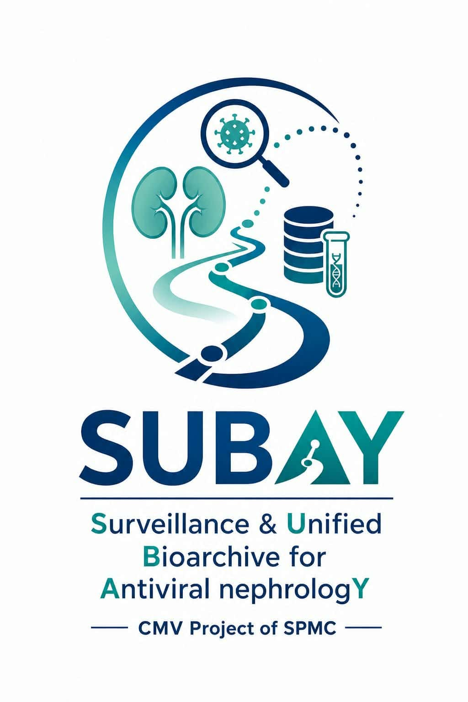

<p align="center">
  
</p>

# SUBAY

**Surveillance & Unified Bioarchive for Antiviral nephrologY** — the CMV Project of SPMC.

A Django registry for CMV genotyping and de-identified analysis-set export.

## Getting started

```bash
cd /opt/subay
# Activate the environment (subay-env helper + subay_env conda env), then:
python manage.py migrate
python manage.py runserver
```

Copy `.env.example` to `.env` for local development. Postgres is used in
production; omit its settings locally to fall back to sqlite for tests.

## Documentation

- [`docs/MANAGE.md`](docs/MANAGE.md) — `manage.py` command reference (custom
  commands: `enroll_totp`, `export_analysis_set`, `ingest_genotyping`).
- [`docs/decisions/`](docs/decisions/) — architecture decision records.
- [`docs/`](docs/) — design notes.
